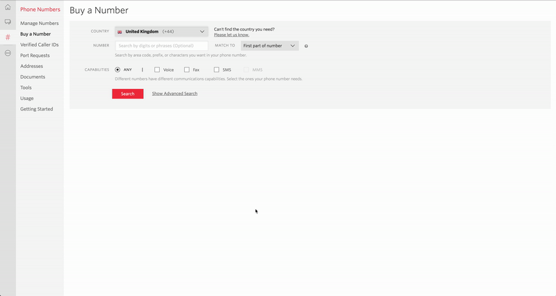
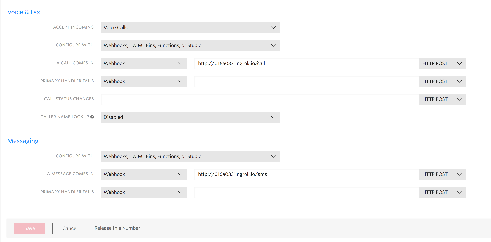

# twilio-ghost

## Environment and Project Setup

Buy a Twilio number from the [Twilio Console](https://www.twilio.com/console/phone-numbers/search/).



Set up a config file with all the important details so that we don't have to keep writing them and can keep them separately managed. Store the below in `config.py` and replace the placeholder values with your values.

```
TWILIO_NUMBER = "+447123456789"
PRIVATE_NUMBER = "+447987654321"
```

The following commands will create and activate your virtual environment:
```
virtualenv venv  # sets up the environment
source venv/bin/activate  # activates the environment
pip install -r requirement.txt  # installs our dependencies

# if you are running python3 please run
pip3 install -r requirement.txt
```

Keep ngrok running and open a new terminal window. On the new window run the server with `python server.py`.

Please start Ngrok which will allow us to expose your localhost at port 5000 to incoming requests: `ngrok http 5000`.

Lastly, go to your Twilio dashboard for your number and ensure your ngrok URL with the endpoints `/call` and `/sms` are configured as below:


